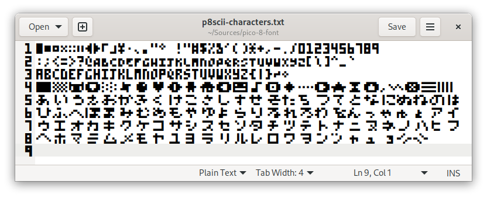

# PICO-8 Font in Vector Formats

Unofficial port to vector formats ([TTF](https://en.wikipedia.org/wiki/TrueType)/[OTF](https://en.wikipedia.org/wiki/OpenType)) of the [bitmap font](https://www.lexaloffle.com/gfx/pico-8_font_022.png) used in the fantasy console [PICO-8](https://www.lexaloffle.com/pico-8.php). The font can be easily installed and used for example in code editors.

The font in this repository is based on an [unofficial font](https://www.lexaloffle.com/bbs/?tid=3760) provided by [RhythmLynx](https://www.lexaloffle.com/bbs/?uid=11704), specifically the *"PICO-8 wide reversed"* variant.

I edited the font in [FontStruct](https://fontstruct.com/fontstructions/show/2052852/pico-8-27). The changes are as follows:

* Update some existing characters so that they match the current original font (for `PICO-8 0.2.4` at the time of writing).
* Remap the wide glyphs to match the UTF-8 encoding of [P8SCII](https://pico-8.fandom.com/wiki/P8SCII).
* Add all missing glyphs (mainly the Katakana and Hiragana alphabet).
* Add line height (1 pixel of white space at the top). Note that a lot of software will ignore or even mangle with the [vertical metrics](https://fontstruct.com/news/2020/05/23/vertical-metrics-improved-touch-support-and-more/).

You can find the table with all the printable characters and their UTF-8 code points in `p8scii-table.txt`. The table is based on the one from the [wiki](https://pico-8.fandom.com/wiki/P8SCII).

To test the font, you can open the `p8scii-characters.txt` file in your text editor. I added the [variation character](https://unicode-table.com/en/FE0E/) to some of the characters to prevent rendering them as emoji.

The license is [CC-0](https://creativecommons.org/publicdomain/zero/1.0/), the same as the original fonts.
